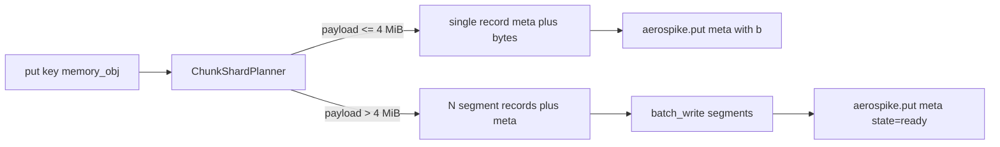

# LMCache Aerospike Backend - Design Document

**Status:** v0.3 — Phase 1 and Phase 2 implemented; Phase 3 native connector in progress (see `main` and `IMPLEMENTATION_PLAN.md`)
**Audience:** Engineers implementing and reviewing an Aerospike storage backend for [LMCache](https://github.com/LMCache/LMCache).
**Scope:** A multi-phase plan delivering an Aerospike-backed remote KV-cache tier for LMCache, anchored to LMCache's `RemoteConnector` plugin contract and a CE-only, adaptive-sharded Aerospike data model tuned for ~4 MiB chunks.

> **v0.3 reconciliation (verified against upstream LMCache `dev`, LMCache native RESP, and the official Aerospike clients).** This revision corrects the design against the actual contracts before implementation. The companion build guide is `IMPLEMENTATION_PLAN.md`. Key changes:
> 1. **Server-side limit discovery runs at connector construction, not `post_init()`** — upstream `RemoteBackend` never calls `post_init()` on a remote connector ([Section 4.3.6](#436-server-side-record-size-discovery), [Section 4.4.0](#440-construction-time-limit-discovery-_ensure_limits-and-the-post_init-override)).
> 2. **Batch API corrected** to `batch_write(BatchRecords([...]))` and `batch_read(keys, [])`; the removed `exists_many`/`get_many`/`select_many` helpers are not used ([Section 4.4.4](#444-async-def-putself-key-cacheenginekey-memory_obj-memoryobj), [Section 4.4.7](#447-def-support_batched_containsself---bool---true-and-def-batched_containsself-keys-listcacheenginekey---int)).
> 3. **Metadata is one serialized `RemoteMetadata` blob (`md` bin), gated on `save_chunk_meta`**, mirroring `FSConnector` — replacing the rigid `shape0..shape3`/`dtype`/`fmt` bins; reads allocate accordingly ([Section 4.3.1](#431-meta-record), [Section 4.4.3](#443-async-def-getself-key-cacheenginekey---optionalmemoryobj)).
> 4. **The connector is serde-agnostic**; `naive`/`cachegen`/`kivi` serde and MLA/layerwise key rewriting happen in `RemoteBackend` above it ([Section 4.4](#44-method-by-method-implementation-spec)).
> 5. **Aerospike client pinned to `>=14,<19`** because `meta={"ttl": N}` is deprecated from `19.1.0`; per-record cap is server-governed (7.1+ `max-record-size` default 1 MiB), and the ops sweet spot is restated as **1-10 KiB** ([Section 2.2](#22-aerospike-just-enough-for-this-design), [Section 4.1](#41-package-layout)).
> 6. **4 MiB `target_segment_bytes` retained** and now cited to the LMCache paper ([arXiv:2510.09665](https://arxiv.org/abs/2510.09665)); the Aerospike ops sweet spot and the LMCache byte-throughput sweet spot are explicitly distinguished ([Section 4.3.4](#434-adaptive-shard-planner)).
> 7. **Phase 3 follows Redis' native mechanics, not its schema by default**: C++ workers, GIL-free pybind submissions, eventfd completions, and direct buffer copies are adopted immediately, while the Phase 1/2 meta+segment schema remains the first native layout. A raw Redis-like schema is reserved for a benchmark-proven follow-up, either as a separate native mode or as a coordinated migration of Phase 1 and Phase 2.

---

## Table of contents

1. [Purpose, scope, and non-goals](#1-purpose-scope-and-non-goals)
2. [Background](#2-background)
3. [Approaches considered](#3-approaches-considered)
4. [Phase 1 - Remote Storage Plugin (implementation-ready)](#4-phase-1---remote-storage-plugin-implementation-ready)
5. [Phase 2 - StoragePluginInterface and L2 adapter (architectural)](#5-phase-2---storageplugininterface-and-l2-adapter-architectural)
6. [Phase 3 - Native C++ connector (implementation-ready direction)](#6-phase-3---native-c-connector-implementation-ready-direction)
7. [Open questions](#7-open-questions)
8. [References](#8-references)

---

## 1. Purpose, scope, and non-goals

### 1.1 Purpose

Deliver an Aerospike-backed remote KV-cache tier for LMCache so that vLLM, SGLang, and other LMCache-integrated inference engines can reuse attention KV-cache chunks across worker restarts, across workers on the same node, and across nodes in a cluster, with predictable millisecond-class retrieval latency and TB-scale capacity at lower DRAM cost than an all-DRAM Redis tier.

### 1.2 In scope

- A Python package, `lmcache-aerospike`, that registers as an LMCache remote storage plugin (`remote_storage_plugins: ["aerospike"]`) via the `ConnectorAdapter` + `RemoteConnector` extension surfaces documented in [LMCache remote storage plugins](https://docs.lmcache.ai/developer_guide/extending_lmcache/remote_storage_plugins.html).
- An adaptive sharding data model that stores LMCache `MemoryObj` payloads as one or many Aerospike records under deterministic keys, optimized for the ~4 MiB chunk band but correct for arbitrary chunk sizes.
- Batch-aware methods (`batched_get`, `batched_put`, `batched_contains`, `batched_async_contains`, `batched_get_non_blocking`) so LMCache prefix-prefetch and write paths can drive concurrent segment I/O.
- Operational guidance specific to Aerospike Community Edition (CE) single-cluster deployments, including TTL/NSUP requirements and capacity planning.
- A roadmap that extends the Phase 1 Python connector into Phase 2 (deeper LMCache plugin surfaces) and Phase 3 (native C++ connector) as scale demands.

### 1.3 Out of scope (Phase 1)

The following are explicitly **not** part of Phase 1. Reviewers should not expect them, and the code must not depend on them:

- **No RDMA / NIXL transport.** LMCache transport mode (prefill/decode handoff) is owned by Mooncake and NIXL. Aerospike participates only in the durable/shared storage tier.
- **No GPU-memory extension.** This connector never touches GPU HBM directly; it serves the CPU-side remote tier.
- **No vector search and no Aerospike Vector Search (AVS).** Stored payloads are binary KV tensors, not embeddings.
- **No Aerospike Graph (AGS).** LMCache does not need graph traversal for its core data path.
- **No Aerospike Enterprise Edition (EE) features.** Durable deletes, Strong Consistency (SC) namespaces, on-disk compression, role-based access control, TLS-required cluster topology, and XDR cross-datacenter replication are **all** unavailable in Phase 1. Where EE features would be the natural fit (durable delete, XDR for cross-region cache sharing), the doc calls out the gap and defers to Phase 2+.
- **No LMCache controller integration.** Cache-location routing and worker/chunk metadata in LMCache's optional controller are handled by LMCache; Phase 1 does not contribute metadata to the controller.
- **No participation in LMCache's `StoragePluginInterface` or `L2AdapterInterface`.** Those are Phase 2.
- **No native C++ connector.** That is Phase 3.

### 1.4 Phase labels

The doc uses these short labels throughout:


| Label                                  | Surface                                                                              | Status                           |
| -------------------------------------- | ------------------------------------------------------------------------------------ | -------------------------------- |
| `phase 1: remote connector`            | `ConnectorAdapter` + `RemoteConnector` (Python)                                      | Implemented                      |
| `phase 2: storage plugin / L2 adapter` | `StoragePluginInterface`, `L2AdapterInterface` (Python `plugin`)                     | Implemented                      |
| `phase 3: native C++ connector`        | `ConnectorBase`-style C++/pybind11 against `libaerospike` via LMCache `native_plugin` | Implementation in progress       |


### 1.5 Success criteria for Phase 1

Phase 1 is "done" when **all** of the following are true:

1. `pip install lmcache-aerospike` succeeds in a fresh Python 3.10-3.13 environment alongside the LMCache version pinned in `pyproject.toml`.
2. An LMCache config with `remote_storage_plugins: ["aerospike"]` and `extra_config` pointing at a running Aerospike CE node round-trips `put` -> `get` for 256 B, 64 KiB, 1 MiB, 4 MiB, 16 MiB, and 64 MiB synthetic chunks.
3. `batched_contains` and `batched_async_contains` return the correct consecutive-prefix-length count, matching the upstream Redis connector's behavior bit-for-bit (see `[redis_connector.py](https://github.com/LMCache/LMCache/blob/dev/lmcache/v1/storage_backend/connector/redis_connector.py)`).
4. A vLLM + LMCache smoke test shows cache hits across a worker restart when this plugin is the remote tier.
5. A bench harness reports p50/p95/p99 `get` latency and bytes/s throughput for hit and miss workloads at the 4 MiB segment band.

---

## 2. Background

### 2.1 LMCache (one paragraph)

LMCache is an open-source LLM inference acceleration layer that sits below frameworks like vLLM and SGLang and caches **key/value attention tensors** for reusable token chunks so repeated long contexts do not have to be prefilled again. It maintains a multi-tier KV hierarchy (GPU HBM, CPU DRAM, local disk/NVMe, remote storage) and exposes pluggable backends for the remote tier. The primary key type is `[CacheEngineKey](https://github.com/LMCache/LMCache/blob/dev/lmcache/utils.py)`, serialized as:

```text
{model_name}@{world_size}@{worker_id}@{chunk_hash_hex}@{dtype}[@tag%value...]
```

A subclass `LayerCacheEngineKey` adds an `@{layer_id}` segment after dtype for layerwise mode. The default chunk size is 256 tokens; the **byte size** of a chunk depends on model size, tensor parallelism, dtype, layer count, and whether layerwise or MLA modes are enabled, and can range from hundreds of KiB to many MiB. LMCache asynchronously writes chunks from CPU to the remote tier and prefetches consecutive chunk prefixes back into CPU/GPU on cache hit. Operating mode is "storage" (the durable/shared tier we target) versus "transport" (real-time prefill/decode handoff, owned by Mooncake/NIXL and out of scope here).

### 2.2 Aerospike (just enough for this design)

Aerospike is a distributed, KV-first database. Records live in a `namespace.set` and are addressed by a user-supplied primary key. Each record has zero-or-more typed `bins` (columns). The primary index holds roughly **64 bytes per record per replica** in RAM and stores a pointer to the record on disk (or in DRAM, depending on storage engine). Operationally relevant constraints for this design:

- **Per-record size cap is server-governed, not a fixed 8 MiB.** Aerospike's streaming-write-block ceiling is 8 MiB, but on Aerospike 7.1+ the effective per-record cap is governed by `max-record-size`, which **defaults to 1 MiB** and is configurable up to 8 MiB; on Aerospike <=7.0 the implicit cap is `write-block-size` (a power of 2 from 128 KiB to 8 MiB). This connector therefore **never hardcodes a cap** — it discovers it at startup (see [Section 4.3.6](#436-server-side-record-size-discovery)) and clamps segment sizes to it. Aerospike's *record-size* sweet spot for **ops-throughput-bound** workloads is roughly **1-10 KiB** (`[model-record-size-hardware-efficiency.md](https://github.com/aerospike/agent-skills/blob/main/skills/aerospike-development/references/model-record-size-hardware-efficiency.md)`); larger records still work but stress device bandwidth, replication, and defrag. **LMCache is byte-throughput-bound, not ops-bound**, so this connector deliberately uses MB-scale segments (see [Section 4.3.4](#434-adaptive-shard-planner)). The two "sweet spots" answer different questions and do not conflict.
- **TTL requires NSUP.** A write that carries a positive integer TTL is rejected with `AEROSPIKE_ERR_FAIL_FORBIDDEN` (error code 22, "Operation not allowed at this time") if the namespace has `nsup-period 0` (NSUP disabled). Special TTL values: `0` = use the namespace/set `default-ttl`; `-1` = never expire; `-2` = don't change void-time on update. See `[single-ttl-nsup-default-ttl.md](https://github.com/aerospike/agent-skills/blob/main/skills/aerospike-development/references/single-ttl-nsup-default-ttl.md)`.
- **One client per process.** The Aerospike client maintains pools and cluster tend state; per-request client creation causes port exhaustion and latency spikes. See `[client-singleton.md](https://github.com/aerospike/agent-skills/blob/main/skills/aerospike-development/references/client-singleton.md)`.
- **Batch APIs.** The version-stable batch surface is `batch_read(keys, bins)` (pass `bins=[]` for metadata-only existence checks) and `batch_write(BatchRecords([...]))` built from `aerospike_helpers.batch.records` (`Write`/`Read`/`Remove`). The legacy `exists_many` / `get_many` / `select_many` helpers were **removed** from the official Python client and are deliberately not used. Per-key result codes must be inspected because overall success does not imply every sub-operation succeeded. See `[batch-parallel-key-operations.md](https://github.com/aerospike/agent-skills/blob/main/skills/aerospike-development/references/batch-parallel-key-operations.md)`.
- **No server-side joins.** Denormalize and embed; design schema around the primary-key access path. See `[model-access-paths-denormalization.md](https://github.com/aerospike/agent-skills/blob/main/skills/aerospike-development/references/model-access-paths-denormalization.md)`.
- **CE limitations.** Community Edition does not support durable deletes, Strong Consistency mode, on-disk compression, or XDR; the design must be correct without them.

### 2.3 Surface-to-implementation mapping

This is the road map for the rest of the doc:


| LMCache extension surface                                                | Aerospike implementation strategy                                                               | Phase |
| ------------------------------------------------------------------------ | ----------------------------------------------------------------------------------------------- | ----- |
| `ConnectorAdapter` + `RemoteConnector` (Python, single-process worker)   | `aerospike` Python client wrapped behind `loop.run_in_executor`; adaptive sharded data model    | 1     |
| `StoragePluginInterface` (Python, full backend, non-multiprocess)        | Same data model; takes ownership of `LocalCPUBackend` interactions for richer admission control | 2     |
| `L2AdapterInterface` (Python `plugin` and `native_plugin`, multiprocess) | Python L2 wraps Phase 1/2; `native_plugin` exposes a C++ adapter with `eventfd` completions     | 2 / 3 |
| Native C++ connector (highest throughput, RESP-style mechanics)          | pybind11 binding over `libaerospike`, LMCache native connector protocol, Phase 1/2 schema first | 3     |


---

## 3. Approaches considered

Before committing to Phase 1's choice, every plausible integration surface was evaluated. This section is the explicit "list of potential ways" requested in the brief.

### 3.1 Remote Storage Plugin: `ConnectorAdapter` + `RemoteConnector` (Phase 1 choice)

- **Contract surface.** Two abstract classes (`[__init__.py](https://github.com/LMCache/LMCache/blob/dev/lmcache/v1/storage_backend/connector/__init__.py)`, `[base_connector.py](https://github.com/LMCache/LMCache/blob/dev/lmcache/v1/storage_backend/connector/base_connector.py)`). Required `RemoteConnector` methods: `exists`, `exists_sync`, `get`, `put`, `list`, `close`. Optional support methods: `batched_get`, `batched_put`, `batched_contains`, `batched_async_contains`, `batched_get_non_blocking`, `remove_sync`, `ping`. The adapter declares a URL scheme (`aerospike://`) and creates the connector from a `ConnectorContext` (URL, loop, `LocalCPUBackend`, config, metadata, plugin instance name).
- **Performance ceiling.** Limited by the Python Aerospike client's synchronous C extension and the cost of marshalling through `loop.run_in_executor`. Adequate for the 100s-10Ks ops/sec band with MB-class payloads, which matches the byte-throughput-dominated profile of LMCache workloads.
- **Complexity.** Lowest of the four surfaces. Fits inside a small Python package with no compiled code.
- **Operational surface.** Plug-in via `remote_storage_plugins: ["aerospike"]` and `module_path` / `class_name` in `extra_config`. No core LMCache changes required.
- **Wins when.** First-customer integrations, single-process LMCache workers, deployments where ops simplicity and time-to-evaluate matter more than peak throughput.
- **Risks.** Python GIL contention under heavy batched fan-out; copy overhead through the LocalCPU buffer; cannot influence pin/unpin or admission policy beyond what LMCache calls into the connector.

### 3.2 `StoragePluginInterface` (Phase 2)

- **Contract surface.** A wider Python interface for full storage backends in non-multiprocess mode (see [LMCache storage plugins](https://docs.lmcache.ai/developer_guide/extending_lmcache/storage_plugins.html)). The plugin owns more of the lifecycle (admission, eviction signaling, lookup) instead of being a passive byte store.
- **Performance ceiling.** Same Python client floor as Phase 1, but eliminates one buffer hop because the plugin can allocate directly into the storage path rather than through `LocalCPUBackend.allocate`.
- **Complexity.** Medium. Surface area is larger, contract is younger and changes more often.
- **Operational surface.** Same install model, different config path.
- **Wins when.** A customer needs pin/unpin fidelity, custom admission control, or wants Aerospike to be the primary remote tier with no `LocalCPUBackend` round-trip.
- **Risks.** Interface stability; debugging breaks deeper into LMCache; behavioral parity with Phase 1 must be maintained for users who don't want the bigger surface.

### 3.3 `L2AdapterInterface`: Python `plugin` and `native_plugin` (Phase 2 / 3)

- **Contract surface.** The L2 adapter slot used in multiprocess mode. A pure Python `plugin` implements the full `L2AdapterInterface`. A `native_plugin` exposes a lower-level pybind/C++ connector with batch get/set/exists/delete and `eventfd` completions.
- **Performance ceiling.** `native_plugin` is the highest-throughput path short of full native C++; it bypasses much of the Python overhead on the hot path and integrates with multiprocess worker scheduling.
- **Complexity.** High. Multiprocess setup, IPC, lifecycle ownership, and `eventfd` plumbing add real cost.
- **Operational surface.** Couples the connector to LMCache's multiprocess deployment model.
- **Wins when.** Customers run LMCache in multiprocess mode and want Aerospike to participate as a first-class L2 tier rather than a passive remote.
- **Risks.** Largest surface area; tightest coupling to LMCache internals; the most fragile across LMCache versions.

### 3.4 Native C++ `ConnectorBase` (Phase 3)

- **Contract surface.** Modeled after LMCache's native Redis/RESP connector (`lmcache/v1/storage_backend/native_clients/resp_client.py` and `ConnectorBase`). Implemented in C++ against `libaerospike`, exposed via pybind11.
- **Performance ceiling.** The highest of the four. Zero-copy writes into LMCache-supplied buffers, no GIL during fetch, asynchronous `as_event_loop` event loop integration.
- **Complexity.** Highest. Build matrix (manylinux wheels), ABI compatibility, debug story, build dependency on `libaerospike` development headers.
- **Operational surface.** Same plugin install model but installs a compiled wheel.
- **Wins when.** Sustained multi-GB/s per worker is required; measured Python overhead exceeds an acceptable percentage of put/get latency.
- **Risks.** Long delivery cycle; need to track upstream LMCache `ConnectorBase` changes; cross-platform packaging cost.

### 3.5 Explicitly rejected alternatives


| Alternative                                        | Why rejected                                                                                                                                                                                                                                                                                                      |
| -------------------------------------------------- | ----------------------------------------------------------------------------------------------------------------------------------------------------------------------------------------------------------------------------------------------------------------------------------------------------------------- |
| Aerospike Vector Search (AVS)                      | LMCache stores binary KV tensors, not embeddings. RAG embedding workloads are upstream of LMCache.                                                                                                                                                                                                                |
| Aerospike Graph Service (AGS)                      | LMCache's data model is hashed token chunks and optional cache-location routing. Lookup tables fit KV/document storage; graph traversal adds no value.                                                                                                                                                            |
| Replace Mooncake/NIXL transport with Aerospike     | RDMA-class transport between prefill/decode workers is a different problem with different SLAs. Aerospike is correctly positioned as the durable/shared tier, not the transport.                                                                                                                                  |
| Replace LMCache's GPU/CPU tiers                    | LMCache owns HBM and DRAM tiers. We only target the remote tier.                                                                                                                                                                                                                                                  |
| Use Aerospike CDTs (lists/maps) for chunk segments | Segments are large opaque byte blobs accessed sequentially. CDTs add server-side overhead with no traversal benefit; flat segment records are simpler and faster. See `[cdt-bounded-collections.md](https://github.com/aerospike/agent-skills/blob/main/skills/aerospike-development/references/cdt-bounded-collections.md)`. |
| Use Aerospike secondary indexes for prefix lookup  | LMCache lookup is by exact `CacheEngineKey`. Secondary indexes are unnecessary and would harm write throughput. See `[query-secondary-index-discipline.md](https://github.com/aerospike/agent-skills/blob/main/skills/aerospike-development/references/query-secondary-index-discipline.md)`.                                 |
| Embed all segments as a CDT list under one key     | Defeats Aerospike's 8 MiB record cap and concentrates load on a single hot record.                                                                                                                                                                                                                                |


### 3.6 Recommendation matrix


| Customer profile                                                                           | Recommended phase / surface                                        |
| ------------------------------------------------------------------------------------------ | ------------------------------------------------------------------ |
| Evaluating Aerospike as an LMCache remote tier; single-process LMCache workers             | Phase 1                                                            |
| Need pin/unpin fidelity or admission control; willing to track LMCache interface churn     | Phase 2 (`StoragePluginInterface`)                                 |
| Running LMCache in multiprocess mode and want first-class L2 participation                 | Phase 2 (`L2AdapterInterface` Python) -> Phase 3 (`native_plugin`) |
| Bytes/s ceiling pushed by 70B+ models at TP>=8; Python overhead measured as the bottleneck | Phase 3 (native C++)                                               |


---

## 4. Phase 1 - Remote Storage Plugin (implementation-ready)

This section is the build specification. Every decision below is intended to be unambiguous; where there is residual ambiguity it is called out in [Section 7](#7-open-questions).

### 4.1 Package layout

```text
lmcache-aerospike/
  pyproject.toml
  README.md
  DESIGN.md
  src/lmcache_aerospike/
    __init__.py
    adapter.py            # AerospikeConnectorAdapter (ConnectorAdapter)
    connector.py          # AerospikeRemoteConnector (RemoteConnector)
    client.py             # AerospikeClientHolder (process-singleton wrapper)
    config.py             # AerospikeConfig (parsed extra_config)
    keys.py               # logical CacheEngineKey -> Aerospike meta + segment keys
    sharding.py           # ChunkShardPlanner (adaptive sizing)
    limits.py             # server-side record-size discovery + segment-limit reconciliation
    serde.py              # MemoryObj metadata <-> Aerospike record bins; RemoteMetadata pack/unpack
    policies.py           # read_policy / write_policy / batch_policy factories
    errors.py             # aerospike.exception.* -> connector behavior mapping
    metrics.py            # optional Prometheus hooks (opt-in)
  tests/
    unit/                 # mocks aerospike.Client; no network
    integration/          # docker-compose single-node CE, namespace lmcache
    bench/                # synthetic chunk stream; pytest-benchmark
  docker/
    docker-compose.yml    # single-node Aerospike CE for integration tests
    aerospike.conf        # namespace lmcache, nsup-period > 0
```

**Distribution.** PyPI package name `lmcache-aerospike`. Versioning: `0.1.x` alpha during Phase 1 bring-up, `0.2.0` first stable Phase 1, `0.3.x` Phase 2 alpha. Python compatibility tracks LMCache: `>=3.10,<3.14`.

**Runtime dependencies.** `aerospike` (official Python client, **version-pinned** — see below), `lmcache` (peer dependency, pinned to a known-good range, e.g. `>=0.4.5,<0.5`), and the standard library. No `numpy` requirement on the connector hot path; `torch` is already an LMCache dependency and the connector uses it only via `MemoryObj`.

**Aerospike client version pin.** Pin to `aerospike>=14.0.0,<19.0.0`. Two reasons: (1) the modern batch API (`batch_read`, `batch_write` with `BatchRecords`) is present and the legacy `exists_many`/`get_many`/`select_many` methods this design avoids are already gone; (2) `meta={"ttl": N}` on `put`/batch `Write` is still valid (it is **deprecated in favor of the write-policy `ttl` from client `19.1.0`**). All TTL setting goes through one `_apply_ttl` helper, so moving the pin to `>=19` later is a one-function change.

### 4.2 Public Python contract

#### 4.2.1 Adapter

`AerospikeConnectorAdapter` inherits from `lmcache.v1.storage_backend.connector.ConnectorAdapter`. It:

- Has a **no-argument `__init__`** that calls `super().__init__("aerospike://")`. This is required: LMCache's `ConnectorManager._remote_adapters_plugin_launcher` instantiates the adapter as `loaded_class()` (no args) when `class_name` resolves to a `ConnectorAdapter` subclass.
- Overrides `can_parse(url)` to accept both `aerospike://...` and `plugin://aerospike[.{instance}]`, using `extract_plugin_type` from the upstream module. For the plugin path the URL LMCache passes is `plugin://{plugin_name}` (built in `RemoteBackend.init_connection`).
- Implements `create_connector(context: ConnectorContext) -> RemoteConnector` by reading `config`/`metadata` from **`context.local_cpu_backend.config` / `.metadata`** (the canonical upstream pattern used by `RESPConnector`/`RedisConnector`/`FSConnector`; fall back to `context.config`/`context.metadata`), building an `AerospikeConfig` from that config plus `context.plugin_name`, obtaining a memoized `AerospikeClientHolder` (keyed by `(hosts, namespace, tls_name)`), and returning an `AerospikeRemoteConnector`. The connector's `__init__` runs server-side limit discovery before returning (see [Section 4.4.0](#440-construction-time-limit-discovery-_ensure_limits-and-the-post_init-override)).

#### 4.2.2 Connector

`AerospikeRemoteConnector` inherits from `lmcache.v1.storage_backend.connector.base_connector.RemoteConnector`. The constructor:

```text
__init__(
    self,
    config: LMCacheEngineConfig,
    metadata: LMCacheMetadata,
    local_cpu_backend: LocalCPUBackend,
    loop: asyncio.AbstractEventLoop,
    aerospike_config: AerospikeConfig,
    client_holder: AerospikeClientHolder,
)
```

calls `super().__init__(config, metadata)` first (this initializes `self.save_chunk_meta`, `self.meta_shapes`, `self.meta_dtypes`, `self.meta_fmt`, `self.full_chunk_size_bytes`, `self.single_token_size`, `self.remote_metadata_bytes` from `base_connector.py`), then stores its dependencies. It implements every abstract method from the base class and overrides every `support_*` predicate that the implementation supports.

#### 4.2.3 Singleton client

`AerospikeClientHolder` is the only place that constructs `aerospike.client(...)`. It is keyed by a tuple of `(hosts, namespace, tls_name)` and reference-counted: each `AerospikeRemoteConnector` increments on construction and decrements on `close()`; the underlying `aerospike.Client` is destroyed only when the count reaches zero. This makes per-process singleton behavior the default (`[client-singleton.md](https://github.com/aerospike/agent-skills/blob/main/skills/aerospike-development/references/client-singleton.md)`) while still supporting multiple plugin instances (`aerospike.primary`, `aerospike.backup`) talking to distinct clusters.

#### 4.2.4 Async strategy

The official `aerospike` Python client is synchronous (a C extension wrapping `libaerospike`). To preserve LMCache's async contract:

- A bounded `concurrent.futures.ThreadPoolExecutor` is created per `AerospikeRemoteConnector` with `max_workers = aerospike_config.executor_threads` (default 16).
- Every blocking call is dispatched via `loop.run_in_executor(self._executor, callable, *args)`.
- A priority scheduler modeled after the Redis connector's `AsyncPQExecutor` (`PEEK`, `PREFETCH`, `GET`, `PUT`; see `[redis_connector.py](https://github.com/LMCache/LMCache/blob/dev/lmcache/v1/storage_backend/connector/redis_connector.py)`) wraps submissions so that prefetch traffic does not starve user-facing `get` calls. Phase 1 implementation uses an `asyncio.PriorityQueue` plus a worker task pool feeding the executor.

### 4.3 Data model (adaptive sharding)

The data model has two record families per logical LMCache key. The logical key is the `CacheEngineKey.to_string()` value (or `LayerCacheEngineKey.to_string()` for layerwise mode).

#### 4.3.1 Meta record

- Aerospike key: `(namespace, set, "{logical_key}|m")`.
- Bins:


| Bin               | Type      | Purpose                                                                                                                                   |
| ----------------- | --------- | ----------------------------------------------------------------------------------------------------------------------------------------- |
| `ver`             | u8 / int  | Schema version of this meta record (starts at 1)                                                                                          |
| `state`           | str       | One of `ready`, `partial`, `tombstone`                                                                                                    |
| `nseg`            | u16 / int | Number of segment records that hold the payload                                                                                           |
| `seg_b`           | u32 / int | Bytes per segment (last segment may be shorter; see `tot_b`)                                                                              |
| `tot_b`           | u64 / int | Total payload bytes across all segments                                                                                                   |
| `md`              | bytes     | Serialized `RemoteMetadata` (`length`, per-group `shapes`/`dtypes`, `fmt`) produced by `RemoteMetadata.serialize()` in `[protocol.py](https://github.com/LMCache/LMCache/blob/dev/lmcache/v1/protocol.py)`. **Present iff `self.save_chunk_meta` is true** (default true; LMCache forces it true in layerwise mode). One opaque blob (size `self.remote_metadata_bytes`) instead of separate shape/dtype bins, so it supports `num_groups > 1` and is byte-compatible with the deserializer. When absent, reads allocate from the connector's fixed full-chunk metadata (`self.meta_shapes/meta_dtypes/meta_fmt`) and call `reshape_partial_chunk`. See [Section 4.4.3](#443-async-def-getself-key-cacheenginekey---optionalmemoryobj) |
| `serde`           | str       | Informational only. `remote_serde` (`naive`/`cachegen`/`kivi`) is applied by LMCache's `RemoteBackend` **above** this connector (the connector is serde-agnostic and stores opaque bytes). Recorded for ops triage; never used to (de)serialize |
| `crc32`           | u32 / int | CRC32 over concatenated segments; present iff `enable_crc32` is true                                                                      |
| `created_at`      | i64 / int | Epoch seconds at successful put                                                                                                           |
| `ttl_class`       | str       | Optional caller-supplied class (e.g. `session`, `corpus`) for ops triage                                                                  |
| `pin`             | bool      | True iff this key was pinned (TTL forced to never-expire)                                                                                 |
| `b`               | bytes     | Inline payload bin; **only present when `nseg == 1`** (the single-record fast path)                                                       |


When `nseg == 1` the meta record itself carries the payload in bin `b`. When `nseg > 1` the `b` bin is absent and segment records hold the payload.

#### 4.3.2 Segment records (only when `nseg > 1`)

- Aerospike key: `(namespace, set, "{logical_key}|s|{i}")` for `i` in `[0, nseg)`.
- Bins:


| Bin     | Type      | Purpose                                                                                         |
| ------- | --------- | ----------------------------------------------------------------------------------------------- |
| `b`     | bytes     | Segment payload (length `seg_b`, except the last segment which is `tot_b - (nseg - 1) * seg_b`) |
| `crc32` | u32 / int | Per-segment CRC32; present iff `enable_crc32` is true                                           |


There is intentionally only one bin in the common case so wire format is minimal.

#### 4.3.3 Key construction

`keys.py` defines:

```text
def meta_key(ns: str, set_: str, ck: CacheEngineKey | LayerCacheEngineKey) -> aerospike_key
def segment_key(ns: str, set_: str, ck: ..., i: int) -> aerospike_key
def segment_keys(ns: str, set_: str, ck: ..., nseg: int) -> list[aerospike_key]
```

User keys passed to Aerospike are byte strings derived from `ck.to_string()` with the `|m` or `|s|{i}` suffix. The Aerospike default of "store the digest, not the key" still applies; `policy.send_key` defaults to `False` (see `[policy-send-key.md](https://github.com/aerospike/agent-skills/blob/main/skills/aerospike-development/references/policy-send-key.md)`) because the logical key is already fully encoded in the digest input and storing it again wastes record space.

#### 4.3.4 Adaptive shard planner

`ChunkShardPlanner` is a pure function (no I/O) that decides how to split a payload, **driven by limits the connector discovered from the server at startup** (see [Section 4.3.6](#436-server-side-record-size-discovery)).

Inputs:

- `payload_bytes: int` (length of `memory_obj.byte_array`)
- `target_segment_bytes: int` - the preferred segment size. Default **4 MiB** = `4 * 1024 * 1024`. Automatically clamped down at startup if the server-side cap is lower.
- `max_segment_bytes: int` - the hard ceiling per segment. **Derived from the server**, not hardcoded: see [Section 4.3.6](#436-server-side-record-size-discovery). Operator override via `extra_config` is allowed but must stay at or below the server value.
- `min_segment_bytes: int` - the lower bound below which sharding is not worth the extra meta/segment round trips. Default `64 KiB` = `64 * 1024`. (This is a sharding-overhead floor, **not** the Aerospike ops sweet spot, which is the smaller 1-10 KiB band; see [Section 2.2](#22-aerospike-just-enough-for-this-design).)
- `single_record_threshold_bytes: int` - the inclusive cutoff for the single-record fast path. Default `min(target_segment_bytes, max_segment_bytes)`.

Decision rule:

1. If `payload_bytes <= single_record_threshold_bytes` **and** `payload_bytes <= max_segment_bytes`: return `(nseg=1, seg_b=payload_bytes)`. Single-record fast path; meta record holds the payload in bin `b`.
2. Else, compute `nseg = ceil(payload_bytes / target_segment_bytes)` and `seg_b = ceil(payload_bytes / nseg)`. This balances segments (no tiny tail) and guarantees `seg_b <= target_segment_bytes`. If the result has `seg_b > max_segment_bytes` (only possible when an operator override invalidates the relationship), raise `AerospikeConfigError`.
3. Enforce `seg_b >= min_segment_bytes` only as a warning: if a payload is small enough that all segments would land below `min_segment_bytes`, the planner falls back to rule 1 (single-record path) regardless of the threshold.

The intent: the ~4 MiB band is the **LMCache authors' documented chunk-transfer sweet spot** between per-transfer/round-trip overhead and transfer time. The LMCache paper ("LMCache: An Efficient KV Cache Layer for Enterprise-Scale LLM Inference", [arXiv:2510.09665](https://arxiv.org/abs/2510.09665), Section 4.1 "Batched Operations" and Section 7 transfer-granularity evaluation) shows that page-level KB transfers underutilize bandwidth and that MB-scale chunks are required to saturate PCIe/network links; LMCache therefore aggregates many small pages into larger configurable chunks. This is **byte-throughput** guidance and is distinct from Aerospike's **ops-throughput** 1-10 KiB record sweet spot (see [Section 2.2](#22-aerospike-just-enough-for-this-design)); the connector intentionally follows the LMCache value. The server's actual configured record-size cap is respected as the hard ceiling and clamps `target_segment_bytes` down if it is lower (e.g. the Aerospike 7.1+ `max-record-size` default of 1 MiB). Sharding kicks in for anything that does not fit a single record cleanly.

Diagram:




#### 4.3.5 Atomicity protocol

LMCache writes are idempotent per `chunk_hash`: two writers for the same `CacheEngineKey` may race, but both produce the same payload bytes for the same key (the chunk hash is content-addressed). The protocol exploits this:

1. **Multi-segment put:**
  1. Write all segment records via `Client.batch_write` (or sequential `Client.put` if batch_write is unavailable in the chosen client version), each with the configured TTL.
  2. Write the meta record last with bins set to `state="ready"`, the final `nseg`, `tot_b`, `seg_b`, `ver`, and the rest of the metadata bins. If `enable_crc32`, include `crc32` over the concatenated payload.
2. **Single-record put:**
  1. Write the meta record with inline bin `b` and `state="ready"` in one `Client.put`. No segments.
3. **Reader:**
  1. Read the meta record. If absent, return miss.
  2. If `state != "ready"`, return miss (treat as partial / in-flight).
  3. If `nseg == 1`, read bin `b` from the meta record; assemble `MemoryObj`.
  4. If `nseg > 1`, build the segment key list and issue **one** `Client.batch_read`. If any segment is missing or returns a partial read, log a WARNING and return miss. Concatenate segments in order; verify `tot_b`; if `enable_crc32`, verify CRC.
4. **Overwrite:** bump `ver`. Readers that race a write see either fully old or fully new bytes (because the meta record commits last with `state="ready"`); they never see a mix.
5. **Generation/CAS (`policy-generation-cas.md`) is intentionally not used** because writes for the same `CacheEngineKey` are idempotent in LMCache's model. CAS would add round trips without correctness benefit. This is a deliberate design choice and is reverted only if a future workload demonstrates a need.
6. **Crash mid-write:** segments may exist without a `ready` meta. Two recovery paths:
  - **Passive (default):** the meta TTL (and segment TTLs) will expire the records via NSUP. No background sweep needed.
   - **Active (opt-in via `extra_config.aerospike.enable_repair_scan`, default false):** a periodic scan can identify orphan segments. Phase 1 ships the passive path only.

#### 4.3.6 Server-side record size discovery

`max_segment_bytes` is **not** hardcoded. The connector queries the live Aerospike cluster at startup and derives the cap from what the namespace actually allows. This means the same connector binary works against Aerospike 6.x, 7.0.x, and 7.1+ deployments without manual tuning, and it picks up operator changes to `write-block-size` / `flush-size` / `max-record-size` automatically on the next restart.

**Probe placement (⚠ corrected from an earlier draft).** Discovery runs **during connector construction** (inside `create_connector` / `AerospikeRemoteConnector.__init__`), guarded by a `self._limits_ready` once-flag — **not** in `post_init()`. This is a deliberate correction: upstream `RemoteBackend.init_connection()` calls `CreateConnector(...)` and stores the wrapped connector but **never calls `connector.post_init()`** (verified across `[remote_backend.py](https://github.com/LMCache/LMCache/blob/dev/lmcache/v1/storage_backend/remote_backend.py)`, `[storage_manager.py](https://github.com/LMCache/LMCache/blob/dev/lmcache/v1/storage_backend/storage_manager.py)`, and the storage-backend `[__init__.py](https://github.com/LMCache/LMCache/blob/dev/lmcache/v1/storage_backend/__init__.py)` `CreateStorageBackends`). A probe placed only in `post_init` would silently never run and `max_segment_bytes` would be left unset, crashing the first `put`. We still provide a `post_init` override that triggers the same idempotent discovery in case a future LMCache release calls it, but correctness does not depend on it. The probe performs:

1. `Client.info_random_node(f"namespace/{namespace}")` to fetch the namespace's config + stats as a semicolon-separated `key=value` string (this form is used by the official client's `ttl.py` example and is robust across server versions; `get-config:context=namespace;id={namespace}` also works). Strip any leading `request\t` prefix from the info response before parsing.
2. Parse three fields, preferring the most specific limit available (server-version-aware):
   - `max-record-size` (Aerospike 7.1+ only) - the explicit per-record cap. Default `1M` in 7.1+; configurable up to `8M`. If present and non-zero, this is the cap.
   - `write-block-size` (Aerospike <=7.0) - the streaming-write-block size, which is also the implicit max record size on those versions. Allowed values are powers of 2 from 128 KiB to 8 MiB.
   - `flush-size` (Aerospike 7.1+) - the I/O unit size. Informational only; the SWB is hard-coded to 8 MiB in 7.1+ and `max-record-size` is the real cap.
3. Compute `server_max_record_bytes` from those fields.
4. Compute `effective_max_segment_bytes = server_max_record_bytes - SAFETY_MARGIN_BYTES`, where `SAFETY_MARGIN_BYTES = 65536` (64 KiB) leaves room for the meta bins (`ver`, `state`, shape, dtype, etc.) on the single-record fast path, where a payload bin lives alongside metadata in the same record.
5. Reconcile with operator config:
   - If `extra_config.aerospike.max_segment_bytes` is unset, use `effective_max_segment_bytes`.
   - If the operator override is `<= effective_max_segment_bytes`, accept it.
   - If the operator override is `> effective_max_segment_bytes`, log WARNING and clamp to `effective_max_segment_bytes` (rather than failing). Operator intent is preserved as much as possible; cluster correctness is not.
6. Reconcile `target_segment_bytes` similarly: if the configured target exceeds `effective_max_segment_bytes`, log WARNING and clamp `target_segment_bytes = effective_max_segment_bytes`.
7. Recompute `single_record_threshold_bytes = min(configured_single_record_threshold_bytes, effective_max_segment_bytes)`.
8. **TTL/NSUP precondition (fail fast).** The same info response carries `nsup-period`. If `default_ttl_seconds > 0` and the namespace reports `nsup-period 0` (NSUP disabled), raise `AerospikeTTLConfigError` immediately with an actionable message pointing at the namespace config. This surfaces the misconfiguration at startup instead of as a cryptic `AEROSPIKE_ERR_FAIL_FORBIDDEN` (code 22) on the first write.

**Logging.** On every connector startup, the connector emits one INFO line per discovered limit so operators can confirm the cluster's view of itself matches their expectation:

```text
INFO  lmcache_aerospike.connector  Aerospike namespace 'lmcache' record-size limits discovered:
INFO  lmcache_aerospike.connector    server: max-record-size=4194304, write-block-size=N/A, flush-size=131072
INFO  lmcache_aerospike.connector    derived: max_segment_bytes=4128768 (server cap minus 64 KiB margin)
INFO  lmcache_aerospike.connector    effective: target_segment_bytes=4128768, single_record_threshold_bytes=4128768, min_segment_bytes=65536
```

If the operator's configured `target_segment_bytes` was clamped, that line is logged at WARNING with the original and clamped values.

**Failure modes.**

- If the `info` call fails (e.g. the namespace name is wrong, or the client cannot reach any node), startup fails fast with `AerospikeNamespaceProbeError` containing the actual server response. No fallback to a guessed cap.
- If the parsed value is zero, missing, or out of the valid range (128 KiB - 8 MiB), startup fails fast with `AerospikeServerLimitError`. We never silently fall back to a guessed cap because doing so risks `RecordTooBig` exceptions in production.
- The probe is per-namespace; multiple plugin instances each probe their own namespace.

**Refresh.** Limits are read once at startup. Operator changes to `max-record-size` / `write-block-size` require a connector restart to take effect. A future enhancement (out of Phase 1 scope) may add periodic re-probing.

**Tests.**
- Unit: parser correctness for sample `get-config` responses from 7.1+ (with `max-record-size`) and 7.0 (with only `write-block-size`).
- Integration: change `max-record-size` in the test container, restart the connector, assert the new cap is reflected in the startup log and that puts above it now shard differently.

### 4.4 Method-by-method implementation spec

Each subsection mirrors the corresponding method in [`base_connector.py`](https://github.com/LMCache/LMCache/blob/dev/lmcache/v1/storage_backend/connector/base_connector.py). Signatures below are verbatim from the upstream `dev` branch.

**Two cross-cutting facts that constrain every method (verified against upstream `dev`):**

1. **The connector is serde-agnostic.** LMCache's `RemoteBackend` applies `remote_serde` (`naive` / `cachegen` / `kivi`) **above** the connector: it calls `serializer.serialize(memory_obj)` *before* `connector.put` and `deserializer.deserialize(...)` *after* `connector.get` (see `[remote_backend.py](https://github.com/LMCache/LMCache/blob/dev/lmcache/v1/storage_backend/remote_backend.py)`). The connector therefore stores **opaque bytes** and must, on read, return a `MemoryObj` shaped so the deserializer can consume it. It never compresses or interprets payloads. This is exactly the `FSConnector` contract (`[fs_connector.py](https://github.com/LMCache/LMCache/blob/dev/lmcache/v1/storage_backend/connector/fs_connector.py)`).
2. **MLA / layerwise key handling happens above the connector.** `RemoteBackend` rewrites keys to `worker_id 0` in `remote_enable_mla_worker_id_as0` mode before calling the connector, and layerwise mode produces `LayerCacheEngineKey` strings. The connector treats both uniformly via `key.to_string()` and needs no special path; layerwise mode does, however, force `self.save_chunk_meta = True`, so the `md` bin (see [Section 4.3.1](#431-meta-record)) is always written in that mode.

#### 4.4.0 Construction-time limit discovery (`_ensure_limits`) and the `post_init` override

- **Purpose:** run the server-side record-size discovery described in [Section 4.3.6](#436-server-side-record-size-discovery) before any user request is served.
- **Where it runs (⚠ corrected):** in `AerospikeRemoteConnector.__init__` (invoked from the adapter's `create_connector`), via a private `_ensure_limits()` guarded by a `self._limits_ready` once-flag. It does **not** rely on `post_init()` being called, because upstream `RemoteBackend` never calls `post_init()` on a remote connector (see [Section 4.3.6](#436-server-side-record-size-discovery)). A `post_init(self)` override is still provided and simply calls `self._ensure_limits()` (idempotent), so the connector remains correct whether or not LMCache ever calls it.
- **Implementation:** invoke `Client.info_random_node("namespace/" + namespace)`, parse `max-record-size` (preferred) / `write-block-size` / `flush-size`, compute `effective_max_segment_bytes` with the 64 KiB safety margin, reconcile against `extra_config` overrides (clamping with WARNING when needed), check the TTL/NSUP precondition, and persist the resolved limits on `self`.
- **Logging:** emit the INFO lines shown in [Section 4.3.6](#436-server-side-record-size-discovery). A clamped target produces a WARNING.
- **Failure:** raise `AerospikeNamespaceProbeError`, `AerospikeServerLimitError`, or `AerospikeTTLConfigError` per the [error matrix](#47-error-handling-matrix). Do not fall back to a guessed cap. A construction-time raise propagates to `RemoteBackend.init_connection`, which logs it and retries per its `min_reconnect_interval` — i.e. fail loud, never silently.
- **Idempotent:** safe to call multiple times (e.g. on reconnect / `recreate_backend`); subsequent calls are no-ops.

#### 4.4.1 `async def exists(self, key: CacheEngineKey) -> bool`

- **Purpose:** True iff a fully-committed entry exists for `key`.
- **Aerospike ops:** `Client.exists(meta_key)` returning `(key, meta)`; if `meta` is None, return False. Else also fetch only the `state` bin via `Client.select(meta_key, ["state"])` (single round trip if we use `select` directly).
- **Optimization:** in practice `Client.select(meta_key, ["state"])` is one round trip and tells us both existence and state; prefer it.
- **Policy:** `read_policy` with `total_timeout = aerospike_config.read_timeout_ms`, replica `MASTER_PROLES` (sequential failover), `key=POLICY_KEY_DIGEST`, `send_set_name=False`.
- **Failure mapping:** `aerospike.exception.RecordNotFound` -> return False; `aerospike.exception.TimeoutError` -> log WARNING, raise; other client errors raise after mapping in `errors.py`.
- **Concurrency:** `PEEK` priority, dispatched via the executor.
- **Tests:** unit (mocked client, present/absent/partial); integration (round-trip after `put`).

#### 4.4.2 `def exists_sync(self, key: CacheEngineKey) -> bool`

- **Implementation:** same logic as `exists`, but calls the synchronous Aerospike client directly on the calling thread. No executor dispatch (the caller is already synchronous).
- **Caveat:** must remain thread-safe because LMCache may call this from background threads.

#### 4.4.3 `async def get(self, key: CacheEngineKey) -> Optional[MemoryObj]`

- **Purpose:** Return the `MemoryObj` for `key`, or `None` on miss.
- **Read meta + verify:** `Client.get(meta_key)` -> `(key, meta, bins)`; on `RecordNotFound` return None; if `bins["state"] != "ready"` return None (treat partial/in-flight as miss).
- **Allocate the receive buffer (honor `save_chunk_meta`, ⚠ corrected to match `[fs_connector.py](https://github.com/LMCache/LMCache/blob/dev/lmcache/v1/storage_backend/connector/fs_connector.py)`):**
  - if `self.save_chunk_meta` is true: `rm = RemoteMetadata.deserialize(bins["md"])`; `memory_obj = self.local_cpu_backend.allocate(rm.shapes, rm.dtypes, rm.fmt)`. Do **not** call `reshape_partial_chunk` — the stored shapes already encode the true (possibly partial) size, including `num_groups > 1`.
  - else (`save_chunk_meta` false): `memory_obj = self.local_cpu_backend.allocate(self.meta_shapes, self.meta_dtypes, self.meta_fmt)`; after the payload is filled, call `self.reshape_partial_chunk(memory_obj, bytes_read)` (where `bytes_read` is a multiple of `self.single_token_size`) so the returned `MemoryObj` has the correct shape.

  Allocation must go through `self.local_cpu_backend.allocate` so LMCache's memory bookkeeping (refcount, pin) stays accurate. If it returns None (CPU backend full), return None and let LMCache decide whether to retry. The earlier draft's "always allocate via `self.meta_shapes`" was wrong: it breaks `cachegen`/`kivi` serde (variable serialized size) and `num_groups > 1`.
- **Payload read, single-record path (`nseg == 1`):** copy `bins["b"]` into `memory_obj.byte_array`.
- **Payload read, multi-segment path (`nseg > 1`):** build the segment key list (`[segment_key(..., i) for i in range(nseg)]`) and issue **one** `Client.batch_read(segment_keys, ["b"])`; walk `brs.batch_records` **in order**, verifying `rec.result == 0` and `rec.record is not None`, and concatenate the `b` bins in order into `memory_obj.byte_array`.
- **Partial-read handling:** if any segment entry is missing or has a nonzero per-record result, log WARNING ("orphan or in-flight write"), release the `MemoryObj` (`ref_count_down()`), and return None. Do not raise.
- **Optional CRC:** if `enable_crc32`, compute CRC32 over the assembled bytes and compare to `meta["crc32"]`; mismatch -> log ERROR, release the `MemoryObj`, return None.
- **Policy:** read policy with `replica=POLICY_REPLICA_SEQUENCE` for failover; `socket_timeout` and `total_timeout` from config.
- **Failure mapping:** `RecordNotFound` -> None; `TimeoutError` -> log + None (treat as miss); other errors mapped in `errors.py` and raised.
- **Concurrency:** `GET` priority.
- **Tests:** unit (single-record path, multi-segment path, missing segment, CRC mismatch, partial chunk reshape); integration (matrix of payload sizes).

#### 4.4.4 `async def put(self, key: CacheEngineKey, memory_obj: MemoryObj)`

- **Purpose:** Store `memory_obj.byte_array` under `key`.
- **Pipeline:**
  1. Acquire `memoryview` of `memory_obj.byte_array`.
  2. `plan = ChunkShardPlanner.plan(len(view), aerospike_config)`.
  3. Build the meta bins. When `self.save_chunk_meta` is true, include `md = RemoteMetadata(len(view), memory_obj.get_shapes(), memory_obj.get_dtypes(), memory_obj.get_memory_format()).serialize()` (one opaque blob; mirrors `[fs_connector.py](https://github.com/LMCache/LMCache/blob/dev/lmcache/v1/storage_backend/connector/fs_connector.py)`). When false, omit `md`. Build shape/dtype/fmt from `memory_obj.get_*()`, **not** from `self.meta_shapes` (the serialized object may be a compressed/binary `cachegen`/`kivi` representation whose shape differs from the full chunk).
  4. If `plan.nseg == 1`: one `Client.put(meta_key, bins | {"b": bytes(view)}, meta=<ttl meta>, policy=<write_policy>)`.
  5. Else (⚠ corrected to the real batch API): build a `BatchRecords` of per-segment `Write` ops and commit the meta record **last**:

     ```python
     from aerospike_helpers.batch import records as br
     from aerospike_helpers.operations import operations as op
     writes = [
         br.Write(
             key=segment_key(ns, set_, ck, i),
             ops=[op.write("b", bytes(view[i*seg_b:(i+1)*seg_b]))],
             meta=ttl_meta, policy=write_policy,
         )
         for i in range(plan.nseg)
     ]
     batch = br.BatchRecords(writes)
     client.batch_write(batch)
     for rec in batch.batch_records:          # inspect per-key results
         if rec.result != 0:
             raise <mapped error>             # top-level success != per-key success
     client.put(meta_key, bins | {"state": "ready"}, meta=ttl_meta, policy=write_policy)
     ```

     `Client.batch_write` takes a single `BatchRecords` object built from `aerospike_helpers.batch.records` — **not** a list of `(key, bins, meta)` tuples. Per-key results must be inspected (`[batch-parallel-key-operations.md](https://github.com/aerospike/agent-skills/blob/main/skills/aerospike-development/references/batch-parallel-key-operations.md)`).
- **TTL (⚠ set in one place):** `ttl_for(key)` returns `-1` if pinned, else `aerospike_config.default_ttl_seconds` (`0` = namespace `default-ttl`, `-2` = don't update void-time). The actual mechanism is centralized in a single `_apply_ttl` helper because `meta={"ttl": N}` is valid only on Aerospike Python client `< 19.1.0`; from `19.1.0` TTL moves to the write policy. The connector pins the client version (see [Section 4.1](#41-package-layout)) and the helper is the only code that touches the version-sensitive API.
- **Memory:** after `put` returns, LMCache decrements the `MemoryObj` refcount; the connector must not retain references past return.
- **Policy:** `write_policy` with `key=POLICY_KEY_DIGEST`, `commit_level=POLICY_COMMIT_LEVEL_ALL` (CE default; configurable down to `MASTER` via `extra_config`); `exists=POLICY_EXISTS_IGNORE` (overwrite-always); `gen=POLICY_GEN_IGNORE` (no CAS).
- **Failure mapping:** `RecordTooBig` -> raise `AerospikeRecordTooBigError` with explicit guidance (lower `target_segment_bytes` or `max_segment_bytes`). `TimeoutError` -> log + raise (caller decides retry). Other errors raised.
- **Concurrency:** `PUT` priority.
- **Tests:** unit (single-record put, multi-segment put with mocked batch_write, oversized payload raises); integration (round-trip; verify TTL via `Client.exists` after expiry).

#### 4.4.5 `def support_batched_get(self) -> bool` -> True and `async def batched_get(self, keys: List[CacheEngineKey]) -> List[Optional[MemoryObj]]`

- **Purpose:** Parallel `get` for many keys.
- **Implementation:** bounded `asyncio.Semaphore(aerospike_config.batch_max_in_flight)`; gather `self.get(k)` for each key under the semaphore; return results in the same order. Each `get` is independent so existing single-key logic applies.
- **No coalescing required:** LMCache passes distinct keys (per `[batch-parallel-key-operations.md](https://github.com/aerospike/agent-skills/blob/main/skills/aerospike-development/references/batch-parallel-key-operations.md)`, the connector still de-duplicates defensively before issuing requests).

#### 4.4.6 `def support_batched_put(self) -> bool` -> True and `async def batched_put(self, keys, memory_objs)`

- Symmetric to `batched_get`. Each `put` independent; bounded by the same semaphore.

#### 4.4.7 `def support_batched_contains(self) -> bool` -> True and `def batched_contains(self, keys: List[CacheEngineKey]) -> int`

- **Purpose:** Consecutive-prefix-length count. This is the **critical** LMCache prefetch primitive.
- **Implementation (⚠ corrected — `exists_many` is removed in current clients):** synchronous `brs = Client.batch_read([meta_key(k) for k in keys], [])`. Passing an **empty bin list** returns metadata only (each `BatchRecord.record` is a `(key, meta)` 2-tuple). Iterate `brs.batch_records` **in original key order**; count consecutive entries with `rec.result == 0` (record found) and return the count at the first miss. `Client.exists_many` / `get_many` / `select_many` were removed from the official Python client (present in 7.0.x, gone in current releases); `batch_read` is the version-stable replacement.
- **State corner case:** `batch_read` with `bins=[]` returns no `state` bin. Phase 1 treats any existing meta record as `ready` because the atomicity protocol writes meta last (with `state="ready"`). An in-flight writer can briefly cause `contains` true / `get` miss; LMCache already handles miss-after-contain by re-prefilling.
- **Coalescing:** the consecutive-prefix semantics operate on the **original order**, so do not reorder; you may still dedupe identical adjacent keys defensively per `[batch-parallel-key-operations.md](https://github.com/aerospike/agent-skills/blob/main/skills/aerospike-development/references/batch-parallel-key-operations.md)`.

#### 4.4.8 `def support_batched_async_contains(self) -> bool` -> True and `async def batched_async_contains(self, lookup_id, keys, pin=False) -> int`

- **Implementation:** dispatch the sync `Client.batch_read([meta_key(k) for k in keys], [])` to the executor with `PREFETCH` priority (⚠ `exists_many` is removed in current clients — see [Section 4.4.7](#447-def-support_batched_containsself---bool---true-and-def-batched_containsself-keys-listcacheenginekey---int)); same consecutive-prefix semantics as `batched_contains`.
- `**pin` argument:** Phase 1 ignores it (the upstream FS connector also ignores it). A future Phase enhancement may bump TTL via `Client.touch` on hits when `pin=True`.

#### 4.4.9 `def support_batched_get_non_blocking(self) -> bool` -> True and `async def batched_get_non_blocking(self, lookup_id, keys) -> List[MemoryObj]`

- **Implementation:** `asyncio.gather(*(self.get(k) for k in keys), return_exceptions=True)`. Walk results in order: append `MemoryObj` while consecutive hits; on first `None` or `Exception`, stop appending and **release** every subsequent successfully-fetched `MemoryObj` via `result.ref_count_down()` to avoid leaks (verbatim contract from `base_connector.py`).
- **Concurrency:** each underlying `get` runs at `PREFETCH` priority.

#### 4.4.10 `def remove_sync(self, key: CacheEngineKey) -> bool`

- **Purpose:** Synchronous delete.
- **Pipeline:** read `nseg` first (`Client.select(meta_key, ["nseg"])`), then `Client.remove(meta_key)` (so future reads miss immediately). Then, if `nseg > 1`, best-effort segment deletes via `Client.batch_write(br.BatchRecords([br.Remove(key=segment_key(..., i)) for i in range(nseg)]))`; failures here are logged at WARNING and ignored because TTL will clean up. (`batch_remove(keys)` is also acceptable; use `BatchRecords([Remove(...)])` for symmetry with the write path.)
- **CE constraint:** `durable_delete=True` is **EE-only**. Phase 1 calls regular delete. Document that deleted records may resurrect on cold restart in CE; this is acceptable for cache data.
- **Return:** True on meta deletion success, False on `RecordNotFound`.

#### 4.4.11 `async def list(self) -> List[str]`

- **Default:** return `[]` and log INFO "list disabled by default (set extra_config.aerospike.enable_list=true to enable expensive scan)". Mirrors the stub posture in upstream connectors where `list` is not in the hot path.
- **When enabled:** issue an Aerospike `Client.scan(namespace, set_).select(["state"])`; yield `key.to_string()` for each meta record where the user-key suffix is `|m`. This is **expensive** and intended only for debugging / migration.
- **Policy:** scan policy with a low priority and a configurable record-rate limit.

#### 4.4.12 `def support_ping(self) -> bool` -> True and `async def ping(self) -> int`

- **Implementation:** `Client.is_connected()` plus `Client.get_node_names()`. Return `0` on success; non-zero (e.g. `1`) on any exception or if no nodes are reachable.

#### 4.4.13 `async def close(self)`

- **Pipeline:** shut down the `AsyncPQExecutor`-equivalent; shut down the `ThreadPoolExecutor` with `wait=True`; decrement the client holder's ref count; if it hit zero, call `client.close()`.
- **Idempotent:** safe to call multiple times.

### 4.5 Configuration surface

#### 4.5.1 LMCache YAML

The user writes the following in their LMCache config (verbatim from the upstream plugin loader, fields documented in [Section 4.5.2](#452-extra_config-reference)):

```yaml
chunk_size: 256
local_cpu: true
max_local_cpu_size: 20
remote_storage_plugins: ["aerospike"]
extra_config:
  remote_storage_plugin.aerospike.module_path: lmcache_aerospike.adapter
  remote_storage_plugin.aerospike.class_name: AerospikeConnectorAdapter
  remote_storage_plugin.aerospike.hosts: "aerospike-0:3000,aerospike-1:3000"
  remote_storage_plugin.aerospike.namespace: lmcache
  remote_storage_plugin.aerospike.set: kv_chunks
  remote_storage_plugin.aerospike.target_segment_bytes: 4194304
  # max_segment_bytes is discovered from the server at startup (see Section 4.3.6).
  # Uncomment to override; the override is clamped to the server's cap.
  # remote_storage_plugin.aerospike.max_segment_bytes: 4128768
  remote_storage_plugin.aerospike.min_segment_bytes: 65536
  # single_record_threshold_bytes defaults to min(target_segment_bytes, max_segment_bytes).
  # remote_storage_plugin.aerospike.single_record_threshold_bytes: 4194304
  remote_storage_plugin.aerospike.default_ttl_seconds: 86400
  remote_storage_plugin.aerospike.read_timeout_ms: 1000
  remote_storage_plugin.aerospike.write_timeout_ms: 2000
  remote_storage_plugin.aerospike.batch_max_in_flight: 64
  remote_storage_plugin.aerospike.executor_threads: 16
  remote_storage_plugin.aerospike.enable_list: false
  remote_storage_plugin.aerospike.enable_crc32: false
  remote_storage_plugin.aerospike.enable_repair_scan: false
  remote_storage_plugin.aerospike.commit_level: all
  remote_storage_plugin.aerospike.replica: sequence
```

Multiple instances are supported via the `{type}.{instance}` plugin naming convention:

```yaml
remote_storage_plugins: ["aerospike.primary", "aerospike.dr"]
extra_config:
  remote_storage_plugin.aerospike.primary.module_path: lmcache_aerospike.adapter
  remote_storage_plugin.aerospike.primary.class_name: AerospikeConnectorAdapter
  remote_storage_plugin.aerospike.primary.hosts: "as-primary:3000"
  remote_storage_plugin.aerospike.primary.namespace: lmcache
  remote_storage_plugin.aerospike.dr.module_path: lmcache_aerospike.adapter
  remote_storage_plugin.aerospike.dr.class_name: AerospikeConnectorAdapter
  remote_storage_plugin.aerospike.dr.hosts: "as-dr:3000"
  remote_storage_plugin.aerospike.dr.namespace: lmcache
```

#### 4.5.2 `extra_config` reference


| Key (relative to `remote_storage_plugin.{plugin_name}.`) | Type | Default          | Effect                                                                                                           |
| -------------------------------------------------------- | ---- | ---------------- | ---------------------------------------------------------------------------------------------------------------- |
| `module_path`                                            | str  | (required)       | Python module that exports the adapter class                                                                     |
| `class_name`                                             | str  | (required)       | Adapter class name; must subclass `ConnectorAdapter`                                                             |
| `hosts`                                                  | str  | (required)       | Comma-separated `host:port` list for cluster seeds                                                               |
| `namespace`                                              | str  | `lmcache`        | Aerospike namespace                                                                                              |
| `set`                                                    | str  | `kv_chunks`      | Aerospike set inside the namespace                                                                               |
| `target_segment_bytes` | int | 4194304 (4 MiB) | Preferred segment size on the multi-segment path. Clamped down at startup if the server's cap is lower (see [Section 4.3.6](#436-server-side-record-size-discovery)) |
| `max_segment_bytes` | int | **discovered** | Hard ceiling per segment. Derived from the server's `max-record-size` (7.1+) or `write-block-size` (<=7.0) minus a 64 KiB safety margin. Operator override is allowed but is clamped to the server-derived value |
| `min_segment_bytes` | int | 65536 (64 KiB) | Lower bound; payloads where every segment would be smaller fall back to the single-record path |
| `single_record_threshold_bytes` | int | `min(target_segment_bytes, max_segment_bytes)` | Inclusive ceiling for the single-record fast path. Defaulted from the discovered cap |
| `default_ttl_seconds`                                    | int  | 86400 (1 day)    | TTL for new records; `0` means "namespace `default-ttl`", `-1` means never expire (requires namespace allows it) |
| `read_timeout_ms`                                        | int  | 1000             | `read_policy.total_timeout`                                                                                      |
| `write_timeout_ms`                                       | int  | 2000             | `write_policy.total_timeout`                                                                                     |
| `batch_max_in_flight`                                    | int  | 64               | Semaphore bound for `batched_get` / `batched_put`                                                                |
| `executor_threads`                                       | int  | 16               | `ThreadPoolExecutor` size                                                                                        |
| `enable_list`                                            | bool | false            | If true, `list()` performs a full set scan; otherwise returns `[]`                                               |
| `enable_crc32`                                           | bool | false            | If true, compute and verify per-payload CRC32                                                                    |
| `enable_repair_scan`                                     | bool | false            | Reserved; Phase 1 ignores. Phase 2+ may use to sweep orphan segments                                             |
| `commit_level`                                           | str  | `all`            | One of `all` or `master`; maps to Aerospike `POLICY_COMMIT_LEVEL_*`                                              |
| `replica`                                                | str  | `sequence`       | One of `master`, `any`, `sequence`, `prefer_rack`; maps to `POLICY_REPLICA_*`                                    |
| `username`                                               | str  | ""               | Optional; only used for EE auth (unused in Phase 1 CE-only)                                                      |
| `password`                                               | str  | ""               | Optional; only used for EE auth (unused in Phase 1 CE-only)                                                      |
| `tls_name`                                               | str  | ""               | Optional; reserved for EE TLS (unused in Phase 1)                                                                |


Validation runs in `AerospikeConfig.from_extra_config(...)` at adapter construction; invalid values raise `AerospikeConfigError` with a message identifying the offending key.

### 4.6 Policies and operational notes

These rules come from `~/github/agent-skills/skills/aerospike-development/references/` and are not optional; reviewers should expect to see them enforced in code review.

- **Singleton client per process** ([`client-singleton.md`](https://github.com/aerospike/agent-skills/blob/main/skills/aerospike-development/references/client-singleton.md)). One `aerospike.Client` per `(hosts, namespace, tls_name)` triple, ref-counted by `AerospikeClientHolder`. Per-request client creation is a defect.
- **One key per batch entry** ([`batch-parallel-key-operations.md`](https://github.com/aerospike/agent-skills/blob/main/skills/aerospike-development/references/batch-parallel-key-operations.md)). Dedupe inputs on the client; never repeat the same key. Multi-operation per key (rare in this connector) goes through `operate` rather than duplicate batch entries.
- **Inspect per-key batch results.** Batch APIs may report top-level success while individual entries fail (`KEY_BUSY`, `RECORD_NOT_FOUND`, generation, policy errors). The connector walks every entry and reports per-entry status.
- **TTL alignment** ([`single-ttl-nsup-default-ttl.md`](https://github.com/aerospike/agent-skills/blob/main/skills/aerospike-development/references/single-ttl-nsup-default-ttl.md)). When `default_ttl_seconds > 0` the Aerospike namespace **must** have `nsup-period > 0`. Otherwise the first write fails with `AEROSPIKE_ERR_FAIL_FORBIDDEN` (code 22). The connector detects this on first put and surfaces an actionable error pointing at the namespace config. Pinned keys use TTL `-1` (and require the namespace to allow it).
- **Send-key off by default** ([`policy-send-key.md`](https://github.com/aerospike/agent-skills/blob/main/skills/aerospike-development/references/policy-send-key.md)). The logical key is fully encoded into the digest input; storing it again wastes record space. Override with `extra_config.aerospike.send_key=true` if ops want it for debugging.
- **Record sizing trade-off** ([`model-record-size-hardware-efficiency.md`](https://github.com/aerospike/agent-skills/blob/main/skills/aerospike-development/references/model-record-size-hardware-efficiency.md)). The Aerospike sweet spot is 1-10 KiB; we deliberately target 4 MiB segments because LMCache bytes/s dominates ops/s. This consciously trades index-RAM efficiency for fewer round trips on the hot KV path. Capacity planning must include device throughput (not just IOPS) for `payload_bytes_per_chunk * chunks_per_second`. If a deployment is device-saturated, the **fallback tuning recipe** is:
  1. Halve `target_segment_bytes` to 2 MiB; observe throughput.
  2. If still saturated, halve again to 1 MiB.
  3. Never go below `min_segment_bytes` (default 64 KiB); below that, index RAM becomes the bottleneck.
- **Server-driven hard ceiling** ([Section 4.3.6](#436-server-side-record-size-discovery)). The connector queries the namespace's `max-record-size` (Aerospike 7.1+) or `write-block-size` (Aerospike <=7.0) at startup, derives `effective_max_segment_bytes`, and logs the discovered values. Operators do **not** set `max_segment_bytes` to "stay safely under 8 MiB" by hand; the framework picks the right cap for the actual cluster. Operator overrides are still allowed for benchmarking but are clamped to the server value with a WARNING.
- **No CDTs** for segment data ([`cdt-bounded-collections.md`](https://github.com/aerospike/agent-skills/blob/main/skills/aerospike-development/references/cdt-bounded-collections.md)). Flat records with one `b` bin per segment outperform a single record with a CDT list of bytes blobs, and avoid the 8 MiB cap problem.
- **No secondary indexes** ([`query-secondary-index-discipline.md`](https://github.com/aerospike/agent-skills/blob/main/skills/aerospike-development/references/query-secondary-index-discipline.md)). All access is by exact primary key.
- **CE-only constraints (explicit).**
  - `durable_delete=True` is EE-only; Phase 1 uses regular delete. Cache resurrection on cold restart is acceptable for KV-cache content.
  - Strong Consistency (SC) namespace mode is EE-only; Phase 1 assumes AP namespaces and tolerates the rare partition window with the existing atomicity protocol (meta-last write).
  - On-disk compression is EE-only; the connector does not rely on it. Optionally, payload-side compression can be layered above LMCache (e.g. CacheGen) and is encoded as `serde="cachegen"` in the meta record.
  - TLS-required client auth is EE-only in the official deployment posture; Phase 1 leaves the `tls_name` config plumbed but inert.
  - XDR cross-datacenter replication is EE-only; Phase 1 customers needing cross-region cache sharing get two plugin instances (`aerospike.primary` and `aerospike.dr`) and write to both; this is documented but not productized in Phase 1.

### 4.7 Error handling matrix

`errors.py` centralizes the mapping. The table below is the contract.

| `aerospike.exception.*` | Connector behavior | Retry? | Observability |
|---|---|---|---|
| `RecordNotFound` | `get` -> None; `exists`/`exists_sync` -> False; `remove_sync` -> False | No | DEBUG log |
| `RecordTooBig` | `put` -> raise `AerospikeRecordTooBigError` with payload size and configured segment caps | No (configuration error) | ERROR log + metric `aerospike_op_total{op,result="record_too_big"}` |
| `TimeoutError` | `get`/`exists`/`batched_*` -> log WARNING, return miss-equivalent; `put`/`remove_sync` -> raise | Caller decides (LMCache may retry) | WARNING log + metric `aerospike_op_total{op,result="timeout"}` |
| `ConnectionError` / `ClientError` (no nodes) | All ops raise `AerospikeConnectionError`; `ping` returns 1 | No (infra issue) | ERROR log + metric |
| `RecordKeyMismatch` | Indicates a key collision or send-key mismatch; raise `AerospikeInternalError` | No (bug) | ERROR log |
| `ServerError` with `AEROSPIKE_ERR_FAIL_FORBIDDEN` (22) on TTL writes | Raise `AerospikeTTLConfigError` with actionable message about `nsup-period` | No (config issue) | ERROR log |
| `DeviceOverload` / `QueueFull` / `KEY_BUSY` | `put` -> raise `AerospikeBusyError`; LMCache retry policy decides | Backoff, jittered retry (delegated to caller) | WARNING log + metric |
| Any other `AerospikeError` | Raise `AerospikeUnknownError` wrapping the original | No | ERROR log with `aerospike_error_code` |
| Startup probe: `info` call fails | Raise `AerospikeNamespaceProbeError` with the raw server response | No (config / connectivity) | ERROR log |
| Startup probe: parsed cap missing / zero / out of range | Raise `AerospikeServerLimitError` | No (server config) | ERROR log |

LMCache itself logs and surfaces these via its instrumented connector wrapper (`InstrumentedRemoteConnector`); the connector does not duplicate that work but does emit per-op metrics.

### 4.8 Observability

- **Logging.** `lmcache_aerospike` uses `lmcache.logging.init_logger(__name__)` to share LMCache's logger configuration. Levels:
  - INFO: connect, close, plugin instance start, scan start/stop.
  - DEBUG: per-op key (digest only, never raw bytes), shard plan decisions.
  - WARNING: partial reads, timeouts, orphan segments, TTL-on-NSUP-off detection.
  - ERROR: all uncategorized exceptions and the `RecordTooBig` / `TTLConfigError` actionable cases.
- **Metrics (opt-in).** `metrics.py` registers Prometheus collectors only if `prometheus_client` is importable. Metrics:
  - `aerospike_op_total{op,result}` (counter) - one of `get`, `put`, `exists`, `batched_*`, `remove`; `result` is `hit`, `miss`, `ok`, `timeout`, `record_too_big`, `busy`, `error`.
  - `aerospike_op_latency_seconds{op}` (histogram) - buckets tuned for 1 ms - 10 s.
  - `aerospike_segment_count` (histogram) - per-`put` shard count; helps tune `target_segment_bytes`.
  - `aerospike_segment_bytes` (histogram) - per-`put` segment size in bytes.
  - `aerospike_concurrent_in_flight` (gauge) - current `batch_max_in_flight` utilization.

### 4.9 Testing strategy

- **Unit tests** (`tests/unit/`). No network. `aerospike.Client` is replaced with a `unittest.mock.MagicMock` or a thin fake. Coverage:
  - `ChunkShardPlanner`: thresholds, boundary at `target_segment_bytes`, boundary at `max_segment_bytes`, oversize raise, server-clamped target behavior.
  - `get-config` response parser: sample responses from Aerospike 7.1+ (`max-record-size=4194304`, `flush-size=131072`), 7.0 (`write-block-size=1048576`), and 6.x (`write-block-size=131072`). Verify `effective_max_segment_bytes` calculation including the 64 KiB safety margin.
  - Startup probe failure modes: missing namespace, unreachable cluster, out-of-range parsed value, all raise the correct typed error and do **not** silently default.
  - Operator override clamping: configured `max_segment_bytes` above the discovered cap is clamped with WARNING; below is accepted as-is.
  - Atomicity: a simulated mid-write failure leaves no `state="ready"` meta; a reader sees miss.
  - `batched_contains` prefix semantics: matches the Redis connector's behavior for `[True, True, False, True]` -> `2`.
  - Error mapping: every entry in the [Section 4.7](#47-error-handling-matrix) table.
  - Partial-chunk reshape via `reshape_partial_chunk` for `bytes_read < full_chunk_size_bytes`.
- **Integration tests** (`tests/integration/`). A `docker-compose.yml` spins a single-node Aerospike CE container based on `~/github/agent-skills/skills/aerospike-getting-started/SKILL.md` (ports 3000-3002 exposed; namespace `lmcache` with `nsup-period 120`). Tests:
  - Startup probe: assert the connector logs the discovered `max-record-size` / `write-block-size`, `effective_max_segment_bytes`, and final clamped `target_segment_bytes`.
  - Live cap change: stop the container, edit `aerospike.conf` to lower `max-record-size`, restart, reconnect, assert puts above the new cap now shard differently.
  - Round-trip payloads at 256 B, 64 KiB, 1 MiB, 4 MiB, 16 MiB, 64 MiB; assert correct shard count from `meta["nseg"]` given the discovered cap.
  - TTL expiry: write with `default_ttl_seconds=2`, sleep 5, assert miss.
  - Pinned keys: write with TTL `-1`, sleep past `default_ttl_seconds`, assert hit.
  - Crash mid-write simulation: write segments, kill before meta; reader sees miss; TTL eventually cleans segments.
  - Multi-instance plugin: write to `aerospike.primary`, read miss from `aerospike.dr`.
- **Bench harness** (`tests/bench/`). `pytest-benchmark`-driven synthetic chunk stream emulating Llama 3.1 70B at TP=8 (chunk sizes derived from the ai-strategy LMCache evaluation). Measure:
  - `get` p50/p95/p99 latency for 100% hit and 100% miss workloads.
  - `put` p50/p95/p99 latency.
  - Sustained bytes/s under 64-concurrent `batched_get`.
  - CPU% of the connector thread pool under load.
- **LMCache integration smoke.** A pytest fixture launches vLLM with LMCache configured against the connector and a tiny model (e.g. Llama 3.2 1B). The test sends two identical long prompts back-to-back across a worker restart and asserts the second request's TTFT is materially lower, indicating cache reuse via Aerospike.
- **CI matrix.** Python 3.10/3.11/3.12/3.13 on Linux x86_64. Integration tests are gated behind `RUN_INTEGRATION=1` so unit tests run on every PR while integration runs on merge to `main`.

### 4.10 Roll-out

- **Versioning.**
  - `0.1.x` - Phase 1 alpha. API may change. Integration smoke required to cut a release.
  - `0.2.0` - Phase 1 stable. Public API frozen for `0.2.x`.
  - `0.3.x` - Phase 2 alpha (`StoragePluginInterface`).
  - `0.4.x` - Phase 2 stable.
  - `1.0.0` - tracked against the LMCache `1.x` major release line, with native connector as an opt-in extra.
- **PyPI.** Package name `lmcache-aerospike`. Wheels and sdist. No compiled code in Phase 1, so the wheel is `py3-none-any`.
- **Install instructions** (to land in `README.md`):

  ```text
  pip install lmcache lmcache-aerospike
  ```

  followed by the YAML snippet from [Section 4.5.1](#451-lmcache-yaml).
- **Upstream LMCache.** Coordinate with LMCache maintainers to list `lmcache-aerospike` on the storage backends index page. This is an open question in [Section 7](#7-open-questions) because the upstream listing policy is not documented.
- **Compatibility matrix.** A small table in `README.md`:

  | `lmcache-aerospike` | `lmcache` | Python | Aerospike server |
  |---|---|---|---|
  | `0.1.x` | `>=0.4.5,<0.5` | 3.10-3.13 | CE 7.x or 8.x |

  Bump the matrix per release; never overpromise compatibility.

---

## 5. Phase 2 - StoragePluginInterface and L2 adapter (architectural)

Phase 2 promotes Aerospike from "remote byte store called by LMCache" to "first-class LMCache storage participant." Two surfaces are in scope: `StoragePluginInterface` (single-process) and `L2AdapterInterface` Python `plugin` (multiprocess). Both are kept under the same `lmcache-aerospike` package, as opt-in entry points.

### 5.1 Why we want it

- **Eliminate one buffer hop.** Phase 1 receives bytes through `LocalCPUBackend.allocate`. Phase 2 lets the plugin own admission and allocation, removing the intermediate buffer for direct-to-Aerospike writes and direct-to-cuda staging on reads.
- **Pin/unpin fidelity.** Phase 1 ignores the `pin` argument in `batched_async_contains`. Phase 2 can implement pin as a TTL refresh on hit (`Client.touch` with a longer TTL) and unpin as TTL restoration.
- **Admission control.** Phase 2 can refuse writes when Aerospike is at device-overload, or apply per-`ttl_class` quotas, in a way Phase 1 cannot.
- **Customer ask.** A design partner running LMCache in multiprocess mode will want native `L2AdapterInterface` rather than going through the simpler remote connector.

### 5.2 Interface surface

The exact upstream interfaces are documented in [LMCache storage plugins](https://docs.lmcache.ai/developer_guide/extending_lmcache/storage_plugins.html). The Phase 2 work items are:

- Implement `AerospikeStoragePlugin(StoragePluginInterface)` mapping to the Phase 1 `AerospikeRemoteConnector` internals where possible (the data model is unchanged).
- Implement `AerospikeL2Plugin(L2AdapterInterface)` for multiprocess mode; share the `AerospikeClientHolder` across processes via a small IPC handshake (process A creates the client; process B receives the connection config and creates its own client - we do not share the C-level client across processes).
- Lifecycle: register both classes in `pyproject.toml` `[project.entry-points."lmcache.storage_plugins"]` so users can switch surfaces with a config change rather than installing a different package.

### 5.3 Data model carries over

The meta + segment data model from [Section 4.3](#43-data-model-adaptive-sharding) is the same. Phase 2 changes only **how** records are accessed (admission, pin, allocation), not **what** is stored. This means Phase 2 can read Phase 1's records and vice versa.

### 5.4 New work items unique to L2

- **Multiprocess setup.** The L2 plugin runs in each LMCache worker process. Each process gets its own `aerospike.Client`; the holder's ref-count semantics still apply within a process.
- **`eventfd` completion bridge.** L2 `native_plugin` paths expect `eventfd`-style completion signaling. The Python L2 plugin in this Phase ships without `eventfd` (Python's `selectors` module is sufficient for the completion-callback pattern); the `native_plugin` variant is deferred to Phase 3.
- **Lifecycle ownership.** L2 plugins participate in LMCache's worker startup/shutdown handshake. The plugin must register cleanup callbacks so the executor and client close on worker shutdown, not only on Python interpreter exit.
- **Memory ownership.** The L2 plugin allocates directly (no `LocalCPUBackend` intermediary), so it must implement an internal allocator (a simple slab over `bytearray` is enough for Phase 2; pinned-memory allocation is a Phase 3 concern).

### 5.5 Risks

- **Interface stability.** `StoragePluginInterface` and `L2AdapterInterface` are younger than `RemoteConnector`; expect breaking changes upstream during the Phase 2 window.
- **Multiprocess deployment complexity.** Debugging crashes across worker processes is harder. Tests must cover both single-process and multiprocess code paths.
- **Performance regression risk.** Removing the `LocalCPUBackend` hop sounds like a win but only if the Aerospike client's threading model is fast enough on its own; benchmarks before promoting Phase 2 to stable.

### 5.6 Decision criteria for Phase 1 -> Phase 2

Promote when **any** of the following is observed in a real deployment:

- Phase 1 `LocalCPUBackend` buffer copy is measured at >=20% of total `get` or `put` latency in the bench harness.
- A customer requires pin/unpin fidelity for compliance or eviction-control reasons.
- A customer runs LMCache in multiprocess mode and surfaces the `RemoteConnector` posture as a limitation.

Until any of these triggers, Phase 1 is the recommended path and Phase 2 stays at design-only.

---

## 6. Phase 3 - Native C++ connector (implementation-ready direction)

Phase 3 replaces the Python L2 hot path with a C++ implementation modeled after LMCache's native RESP connector ([`resp_client.py`](https://github.com/LMCache/LMCache/blob/dev/lmcache/v1/storage_backend/native_clients/resp_client.py), `NativeConnectorL2Adapter`, and the `ConnectorBase` protocol it pairs with). Redis' winning techniques are the native mechanics: C++ worker tiling, GIL-free pybind submissions, one eventfd-backed completion stream, and direct copies into LMCache-provided buffers. Phase 3 adopts those techniques first while preserving the Phase 1/2 Aerospike schema.

### 6.1 Why we want it

The Python connector ceiling is set by GIL contention on the executor pool, copy overhead through `memoryview`, and the synchronous Aerospike Python client's per-call C extension setup. For sustained multi-GB/s per worker (Llama 70B class at large TP, or multiple concurrent inference requests), this overhead becomes the bottleneck. A native connector closes that gap.

### 6.2 Design sketch

- **Language and bindings.** C++17 implementation; pybind11 binding exposed as `lmcache_aerospike._native` and loaded through LMCache's `native_plugin` L2 adapter.
- **LMCache native contract.** Expose `event_fd`, `submit_batch_get`, `submit_batch_set`, `submit_batch_exists`, `submit_batch_delete`, `drain_completions`, and `close`, matching `LMCACHE_BIND_CONNECTOR_METHODS` semantics so `NativeConnectorL2Adapter` handles demux, locking, and L2 task accounting.
- **Client.** Official Aerospike C client (`libaerospike`) with one shared cluster client per native connector instance; workers issue key operations against that client with read/write policies matching Phase 1/2 defaults.
- **Threading.** Use the same worker tiling model as LMCache Redis' native connector: each submitted batch is split across C++ worker threads, and one completion is emitted when all tiles finish. The Python side never holds the GIL after pybind has extracted key strings and memoryview pointers.
- **Buffers.** Writes wrap LMCache-supplied buffers with Aerospike C client bytes values where the API allows; reads copy Aerospike bytes directly into LMCache's preallocated `MemoryObj` buffers without a Python `bytes` hop.
- **Completion model.** Eventfd-based, with per-key result bits for lookup/load/delete and one completion per submitted batch.
- **Data model.** Default native layout is the Phase 1/2 meta+segment schema: inline payload bin `b` for single-record objects, segment records for larger objects, and meta-last publish semantics with `state`, `nseg`, `seg_b`, and `tot_b`. Because L2 loads are preallocated, native code does not need to add new LMCache shape/dtype metadata; it only preserves the existing bins required for compatibility and sharding correctness.

### 6.2.1 Schema evolution policy

Phase 3 does **not** begin by switching to a Redis-like raw one-record schema. That schema can reduce bins and branching, but it would break compatibility with Phase 1/2 records unless every Aerospike path migrates together.

The allowed future paths are:

1. **Separate raw native mode:** keep Phase 1/2 compatible schema as the default, and add an opt-in raw native schema if benchmarks prove schema overhead is a top bottleneck.
2. **Coordinated schema migration:** change Phase 1, Phase 2, and Phase 3 to the faster schema together, with explicit migration or dual-read support.

Do not make a schema-breaking change on guesswork. The benchmark loop must first show that the compatible schema, rather than Python overhead, Aerospike policy choices, worker count, network/device bandwidth, or batch shape, is one of the top bottlenecks.

### 6.3 Build and distribution

- **Build system.** CMake driving pybind11; `cibuildwheel` for manylinux wheels.
- **manylinux wheels.** `manylinux_2_28_x86_64` and `manylinux_2_28_aarch64`.
- **Source build fallback.** If wheels are unavailable, `pyproject.toml` ships a source distribution that links against system `libaerospike-dev`.
- **Runtime linkage.** Dynamic linkage against `libaerospike.so` shipped in the wheel; major-version bumps of `libaerospike` require a new wheel.
- **CI.** Build matrix expands to include the wheel build per platform; native-connector tests gated behind `RUN_NATIVE=1`.

### 6.4 Risks

- **Build matrix cost.** manylinux wheels, ABI compatibility across `libaerospike` releases, debug story (gdb on the native side, py-spy on the Python side, correlating them).
- **Upstream tracking.** LMCache's `ConnectorBase` is the youngest surface; tracking changes will be ongoing work.
- **Operational surface.** Customers debugging will need both Python and C++ familiarity.
- **Schema pressure.** Preserving Phase 1/2 schema may leave some performance on the table versus Redis' raw key/value storage. Treat this as a measured optimization decision, not a Phase 3 prerequisite.

### 6.5 Decision criteria for Phase 2 -> Phase 3

Promote when **any** of the following is observed:

- Bench harness reports sustained CPU saturation on the connector thread pool while the Aerospike cluster has headroom.
- A customer requires sustained per-worker throughput above what Phase 1/2 measured (the exact GB/s threshold is workload-specific; document the customer's actual number as part of the promotion decision).
- LMCache upstream stabilizes `native_plugin` to a level where the maintenance cost is acceptable.

---

## 7. Open questions

These are deliberately not answered in this design. Each is a follow-up that should be resolved before or during the relevant Phase.

1. **Chunk-size distribution.** What is the actual byte-size distribution of LMCache chunks for the first design-partner model, TP, dtype, and `chunk_size`? The 4 MiB target is a defensible default; the bench harness should validate it against real data.
2. **Cache tier intent.** Is the deployment intent hot/warm (minutes-hours TTL), durable shared (days-weeks TTL), or pinned-corpus (`-1` TTL)? Defaults are documented but customer expectations may differ.
3. **Cross-region cache sharing.** XDR is EE-only. CE customers needing cross-region sharing get dual-write via two plugin instances; is that an acceptable productization, or do they need a different solution?
4. **Controller participation.** LMCache's optional controller tracks worker/chunk locations. Phase 1 does not contribute. Should Phase 2 publish location metadata to the controller for cache-aware routing?
5. **Upstream listing.** Will LMCache list `lmcache-aerospike` in the storage backends index, and what is their process for accepting an out-of-tree connector? No commitment yet.
6. **CRC32 default.** Phase 1 ships `enable_crc32=false`. LMCache and the Aerospike storage layer both provide their own integrity guarantees; do we need application-layer CRC, or is it overhead?
7. **Layerwise / MLA mode.** Phase 1 should handle `LayerCacheEngineKey` (which encodes `layer_id` in the key string) correctly without a special code path. Verify with a layerwise integration test before Phase 1 stable.
8. **Authentication.** CE has no auth. EE auth fields (`username`, `password`, `tls_name`) are plumbed but inert in Phase 1. Phase 2+ should validate against an EE cluster.
9. **List API.** Is the disabled-by-default `list()` sufficient for ops, or do we need a paginated public API for catalog inspection?
10. **Repair scan.** When (if ever) should `enable_repair_scan` ship? The passive TTL-based cleanup may be sufficient indefinitely.

---

## 8. References

### 8.1 LMCache source files (upstream `dev` branch unless otherwise noted)

- [`lmcache/v1/storage_backend/connector/__init__.py`](https://github.com/LMCache/LMCache/blob/dev/lmcache/v1/storage_backend/connector/__init__.py) - `ConnectorAdapter`, `ConnectorContext`, `ConnectorManager`, `CreateConnector`, `DynamicConnectorAdapter`, `extract_plugin_type`.
- [`lmcache/v1/storage_backend/connector/base_connector.py`](https://github.com/LMCache/LMCache/blob/dev/lmcache/v1/storage_backend/connector/base_connector.py) - `RemoteConnector` abstract base class. Source of every method signature in [Section 4.4](#44-method-by-method-implementation-spec).
- [`lmcache/v1/storage_backend/connector/redis_connector.py`](https://github.com/LMCache/LMCache/blob/dev/lmcache/v1/storage_backend/connector/redis_connector.py) - Reference implementation; the Aerospike connector mirrors its priority bands, batched contains semantics, and metadata-as-companion-record pattern (although Aerospike collapses to a single record when payload fits).
- [`lmcache/v1/storage_backend/connector/fs_connector.py`](https://github.com/LMCache/LMCache/blob/dev/lmcache/v1/storage_backend/connector/fs_connector.py) - Canonical `save_chunk_meta` pattern: store one serialized `RemoteMetadata` blob and allocate from it on read, else allocate from the connector's fixed metadata and `reshape_partial_chunk`. The Aerospike `md` bin and read path mirror this.
- [`lmcache/v1/storage_backend/remote_backend.py`](https://github.com/LMCache/LMCache/blob/dev/lmcache/v1/storage_backend/remote_backend.py) - The layer **above** the connector. Confirms (a) serde (`naive`/`cachegen`/`kivi`) and MLA/layerwise key rewriting happen here, not in the connector, and (b) `init_connection` calls `CreateConnector` but **never** `post_init()` — the basis for construction-time discovery.
- [`lmcache/v1/storage_backend/storage_manager.py`](https://github.com/LMCache/LMCache/blob/dev/lmcache/v1/storage_backend/storage_manager.py) - Confirms `post_init()` is not invoked at this layer either.
- [`lmcache/v1/protocol.py`](https://github.com/LMCache/LMCache/blob/dev/lmcache/v1/protocol.py) - `RemoteMetadata.serialize`/`deserialize` used for the meta record's single `md` blob bin (supersedes the earlier per-field `shape*`/`dtype`/`fmt` bins).
- [`lmcache/utils.py`](https://github.com/LMCache/LMCache/blob/dev/lmcache/utils.py) - `CacheEngineKey` and `LayerCacheEngineKey` definitions.
- [`lmcache/v1/storage_backend/native_clients/resp_client.py`](https://github.com/LMCache/LMCache/blob/dev/lmcache/v1/storage_backend/native_clients/resp_client.py) - Phase 3 reference pattern.

### 8.2 LMCache documentation and research

- LMCache paper: "LMCache: An Efficient KV Cache Layer for Enterprise-Scale LLM Inference", [arXiv:2510.09665](https://arxiv.org/abs/2510.09665). Source of the **MB-scale chunk-transfer sweet spot** that motivates the 4 MiB `target_segment_bytes` default (see [Section 4.3.4](#434-adaptive-shard-planner)).
- [Remote storage plugins](https://docs.lmcache.ai/developer_guide/extending_lmcache/remote_storage_plugins.html) (Phase 1).
- [Storage plugins / L2 adapters](https://docs.lmcache.ai/developer_guide/extending_lmcache/storage_plugins.html) (Phase 2).
- [Native connectors](https://docs.lmcache.ai/developer_guide/extending_lmcache/native_connectors.html) (Phase 3).
- [Architecture overview](https://docs.lmcache.ai/developer_guide/architecture.html).
- [Engine integration](https://docs.lmcache.ai/developer_guide/integration.html).
- [Redis backend](https://docs.lmcache.ai/kv_cache/storage_backends/redis.html).
- [Storage backends index](https://docs.lmcache.ai/kv_cache/storage_backends/index.html).
- [LMCache Controller](https://docs.lmcache.ai/kv_cache_management/index.html).

### 8.3 Aerospike modeling rules ([agent-skills](https://github.com/aerospike/agent-skills))

- [`client-singleton.md`](https://github.com/aerospike/agent-skills/blob/main/skills/aerospike-development/references/client-singleton.md)
- [`client-pools-warmup.md`](https://github.com/aerospike/agent-skills/blob/main/skills/aerospike-development/references/client-pools-warmup.md)
- [`client-direct-node-access.md`](https://github.com/aerospike/agent-skills/blob/main/skills/aerospike-development/references/client-direct-node-access.md)
- [`policy-client-defaults.md`](https://github.com/aerospike/agent-skills/blob/main/skills/aerospike-development/references/policy-client-defaults.md)
- [`policy-reuse-timeouts-retries.md`](https://github.com/aerospike/agent-skills/blob/main/skills/aerospike-development/references/policy-reuse-timeouts-retries.md)
- [`policy-send-key.md`](https://github.com/aerospike/agent-skills/blob/main/skills/aerospike-development/references/policy-send-key.md)
- [`policy-write-commit-level.md`](https://github.com/aerospike/agent-skills/blob/main/skills/aerospike-development/references/policy-write-commit-level.md)
- [`policy-generation-cas.md`](https://github.com/aerospike/agent-skills/blob/main/skills/aerospike-development/references/policy-generation-cas.md)
- [`policy-replace-whole-record.md`](https://github.com/aerospike/agent-skills/blob/main/skills/aerospike-development/references/policy-replace-whole-record.md)
- [`policy-read-replica-consistency.md`](https://github.com/aerospike/agent-skills/blob/main/skills/aerospike-development/references/policy-read-replica-consistency.md)
- [`single-record-operations.md`](https://github.com/aerospike/agent-skills/blob/main/skills/aerospike-development/references/single-record-operations.md)
- [`single-ttl-expiration-retention.md`](https://github.com/aerospike/agent-skills/blob/main/skills/aerospike-development/references/single-ttl-expiration-retention.md)
- [`single-ttl-nsup-default-ttl.md`](https://github.com/aerospike/agent-skills/blob/main/skills/aerospike-development/references/single-ttl-nsup-default-ttl.md)
- [`single-delete-durable-deletes.md`](https://github.com/aerospike/agent-skills/blob/main/skills/aerospike-development/references/single-delete-durable-deletes.md)
- [`model-access-paths-denormalization.md`](https://github.com/aerospike/agent-skills/blob/main/skills/aerospike-development/references/model-access-paths-denormalization.md)
- [`model-record-size-hardware-efficiency.md`](https://github.com/aerospike/agent-skills/blob/main/skills/aerospike-development/references/model-record-size-hardware-efficiency.md)
- [`model-hot-keys.md`](https://github.com/aerospike/agent-skills/blob/main/skills/aerospike-development/references/model-hot-keys.md)
- [`cdt-bounded-collections.md`](https://github.com/aerospike/agent-skills/blob/main/skills/aerospike-development/references/cdt-bounded-collections.md)
- [`batch-parallel-key-operations.md`](https://github.com/aerospike/agent-skills/blob/main/skills/aerospike-development/references/batch-parallel-key-operations.md)
- [`binop-operate-atomicity.md`](https://github.com/aerospike/agent-skills/blob/main/skills/aerospike-development/references/binop-operate-atomicity.md)
- [`query-secondary-index-discipline.md`](https://github.com/aerospike/agent-skills/blob/main/skills/aerospike-development/references/query-secondary-index-discipline.md)
- [`sec-client-tls-auth.md`](https://github.com/aerospike/agent-skills/blob/main/skills/aerospike-development/references/sec-client-tls-auth.md)

### 8.4 Aerospike core documentation

- [Aerospike Documentation home](https://aerospike.com/docs/).
- [Data model and record sizing](https://aerospike.com/docs/develop/data-modeling/record-sizing).
- [Namespace retention / NSUP](https://aerospike.com/docs/database/manage/namespace/retention).
- [Python client](https://aerospike-python-client.readthedocs.io/).
- [Aerospike getting started skill](https://github.com/aerospike/agent-skills/blob/main/skills/aerospike-getting-started/SKILL.md) - Docker single-node CE setup for integration tests.

### 8.5 Strategic input

- LMCache evaluation in the ai-strategy repository: `~/.config/superpowers/worktrees/ai-strategy/add-lmcache-evaluation/ai/frameworks/lmcache/README.md`. Source for the customer-relevance framing, the storage-tier positioning vs Redis/S3/Mooncake, the scoring matrix, and the original sketch of the Phase 1 connector data model that this doc refines.
